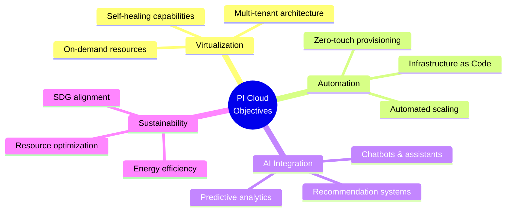

# Project Vision & Global Overview

## 1. Executive Summary

The PI Cloud project aims to build a **sustainable, AI-powered private cloud infrastructure** aligned with the United Nations Sustainable Development Goals (SDGs). This infrastructure will host innovative applications that are:

- **On-demand** and accessible from anywhere
- **Multi-tenant** with complete isolation
- **Auto-scaling** to handle variable traffic
- **AI-integrated** for enhanced user experience

## 2. Core Objectives

