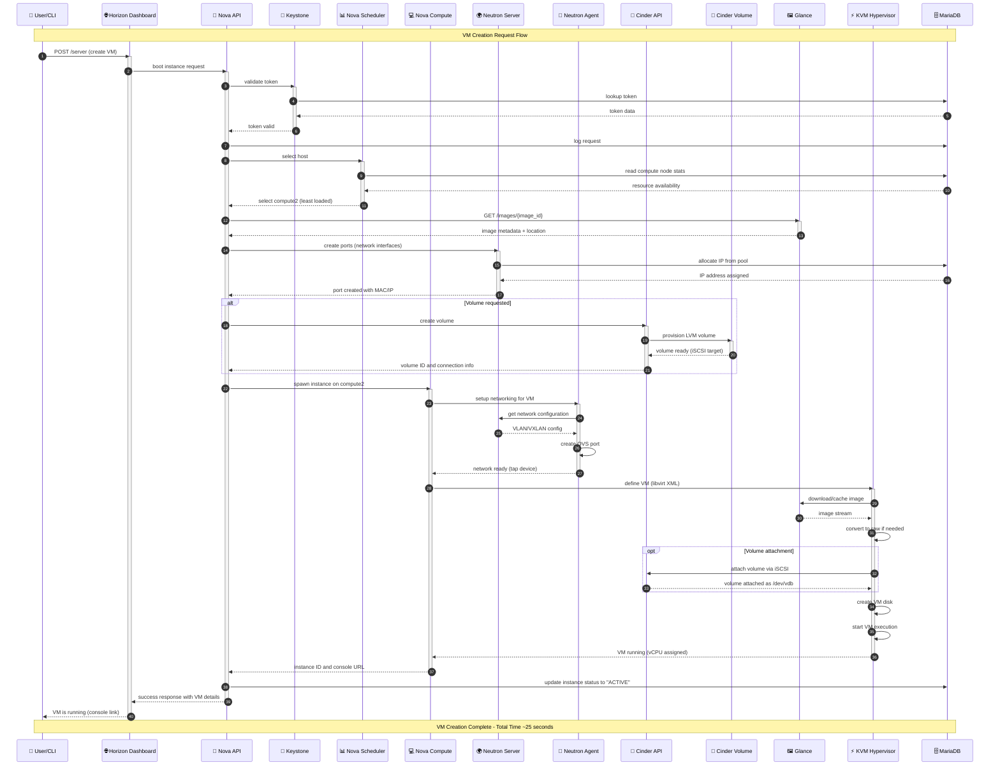

# Component Interaction Design

## Table of Contents
1. [VM Creation Sequence](#1-vm-creation-sequence)
2. [VM Migration Flow](#2-vm-migration-flow)
3. [Auto-scaling Workflow](#3-auto-scaling-workflow)
4. [Authentication Flow](#4-authentication-flow)
5. [Volume Attachment Flow](#5-volume-attachment-flow)
6. [Network Packet Flow](#6-network-packet-flow)
7. [Component Dependencies](#7-component-dependencies)
8. [Error Handling Flows](#8-error-handling-flows)
9. [API Call Flow with Caching](#9-api-call-flow-with-caching)
10. [Interaction Summary Table](#10-interaction-summary-table)

---

## 1. VM Creation Sequence

This diagram shows the complete sequence of events when a user creates a new VM.

