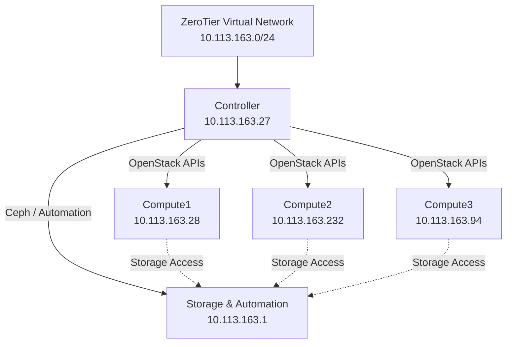
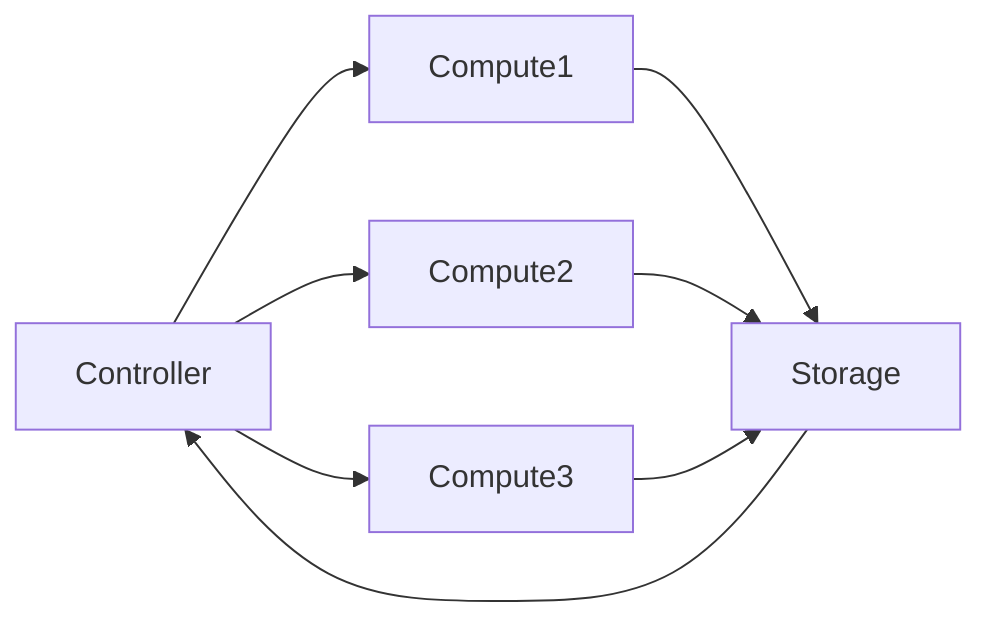

# ZeroTier Overlay Network

## Overview

The PI Cloud infrastructure uses a **ZeroTier Software-Defined Network (SDN)** to securely interconnect all infrastructure nodes across different physical locations.

The overlay network provides:

- Secure encrypted communication between nodes
- Simplified node discovery and routing
- Private Layer-2 virtual networking
- Stable static addressing for infrastructure services
- Simplified OpenStack multi-node deployment

---

## Network Architecture



---

## ZeroTier Network Information

| Parameter | Value |
|---|---|
| Network Technology | ZeroTier SDN |
| Network Type | Overlay Virtual Network |
| Address Space | `10.113.163.0/24` |
| Network ID | `633e31d8a20db0c2` |
| Connectivity | Peer-to-peer encrypted |
| Primary Usage | OpenStack & Kubernetes communication |

---

## Why ZeroTier?

!!! info "Design Choice"
    ZeroTier was selected because it allows all team members to connect their infrastructure nodes securely without requiring enterprise networking hardware or public IP exposure.

### Advantages

- End-to-end encryption
- NAT traversal support
- Simple installation and configuration
- Cross-platform compatibility
- Centralized network management
- Low operational overhead

---

## Node Communication Model



---

## Installation Procedure

### Install ZeroTier

```bash
curl -s https://install.zerotier.com | sudo bash
```

### Join Network

```bash
sudo zerotier-cli join 633e31d8a20db0c2
```

### Verify Connection

```bash
sudo zerotier-cli listnetworks
```

### Test Connectivity

```bash
ping -c 4 10.113.163.27
```

---

## Security Considerations

!!! warning "Access Control"
    Only authorized members are allowed to join the ZeroTier network.

### Security Measures

- Network membership approval required
- Encrypted peer-to-peer communication
- Static internal IP assignment
- Isolated infrastructure traffic
- No direct public exposure of nodes

---

## Expected Connectivity

Each node must be able to:

- Ping all other nodes
- Resolve hostnames through `/etc/hosts`
- Access OpenStack APIs
- Reach Kubernetes services
- Access shared storage resources

---

## Verification Checklist

- [ ] ZeroTier installed successfully
- [ ] Joined correct network
- [ ] Correct static IP assigned
- [ ] Controller reachable
- [ ] All peers visible
- [ ] Stable latency between nodes

---

## Related Pages

- [IP Assignment](ip-assignment.md)
- [Connectivity Matrix](connectivity-matrix.md)
- [High-Level Architecture](../02-architecture/high-level-architecture.md)