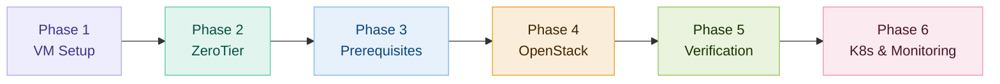

# PI Cloud Infrastructure Documentation

> **Complete design documentation for the ESPRIT PI Cloud Project** — a student-built private cloud platform leveraging OpenStack, Kubernetes, ZeroTier, and modern DevOps tooling.

---

## What is PI Cloud?

PI Cloud is a **fully functional private cloud infrastructure** designed and deployed by a 5-member student team at ESPRIT. The project simulates a real-world cloud environment using bare-metal nodes connected over a ZeroTier virtual network, with OpenStack providing IaaS capabilities and Kubernetes handling container orchestration.

!!! info "Project Scope"
    This documentation covers the full lifecycle of the PI Cloud platform — from hardware rack layout and network design through deployment automation, security hardening, monitoring, and disaster recovery.

---

## Quick Navigation

-   :material-eye-outline: **Global Overview**

    ---

    Project vision, SDG alignment, and team structure.

    [:octicons-arrow-right-24: View Overview](01-global-overview/project-vision.md)

-   :material-lan: **Architecture Design**

    ---

    High-level topology, component interactions, and data flows.

    [:octicons-arrow-right-24: View Architecture](02-architecture/high-level-architecture.md)

-   :material-network: **Network Design**

    ---

    ZeroTier overlay network, IP assignments, and connectivity matrix.

    [:octicons-arrow-right-24: View Network](03-network/zerotier-network.md)

-   :material-server: **Hardware & Resources**

    ---

    Rack layout, node specifications, and resource allocation.

    [:octicons-arrow-right-24: View Hardware](04-hardware/rack-layout.md)

-   :material-layers: **Technology Stack**

    ---

    OpenStack, Kubernetes, monitoring, and automation stack design.

    [:octicons-arrow-right-24: View Stack](05-technology-stack/openstack-design.md)

-   :material-rocket-launch: **Deployment Guide**

    ---

    6-phase step-by-step deployment from VM setup to full production.

    [:octicons-arrow-right-24: Start Deployment](06-deployment/phase1-vm-setup.md)

-   :material-shield-lock: **Security**

    ---

    Credentials management, network security, and compliance.

    [:octicons-arrow-right-24: View Security](07-security/credentials-management.md)

-   :material-chart-line: **Monitoring & Observability**

    ---

    Prometheus configuration, Grafana dashboards, and alerting rules.

    [:octicons-arrow-right-24: View Monitoring](08-monitoring/prometheus-config.md)

-   :material-database-sync: **Backup & Recovery**

    ---

    Backup strategy, recovery procedures, and disaster recovery plans.

    [:octicons-arrow-right-24: View Backup](09-backup-recovery/backup-strategy.md)

-   :material-account-group: **Team Responsibilities**

    ---

    Per-member node ownership and role assignments.

    [:octicons-arrow-right-24: View Team](10-team-responsibilities/meryam-controller.md)

---

## Infrastructure at a Glance

| Component | Technology | Purpose |
|---|---|---|
| IaaS Platform | OpenStack (Kolla-Ansible) | Compute, networking, storage APIs |
| Container Orchestration | Kubernetes (K3s / kubeadm) | Workload scheduling and scaling |
| Virtual Network | ZeroTier `10.147.20.0/24` | Secure overlay between all nodes |
| Metrics & Alerting | Prometheus + Alertmanager | Infrastructure observability |
| Dashboards | Grafana | Visualization and on-call alerting |
| Automation | Ansible | Idempotent configuration management |
| Object Storage | Ceph | Distributed block and object storage |

---

## Deployment Phases

---

## Team

| Member | Node | Role | ZeroTier IP |
|---|---|---|---|
| **Meryam** | Controller | OpenStack control plane, Keystone, Horizon | `10.147.20.1` |
| **Chaima** | Compute 1 | Nova compute, instance scheduling | `10.147.20.2` |
| **Siwar** | Compute 2 | Nova compute, Neutron agent | `10.147.20.3` |
| **Aymen** | Compute 3 | Nova compute, performance testing | `10.147.20.4` |
| **Aziz** | Storage / Automation | Ceph, Ansible, CI/CD pipelines | `10.147.20.5` |

---

## SDG Alignment

!!! success "Sustainable Development Goals"
    This project contributes to the following UN SDGs:

    - **SDG 4** — Quality Education: hands-on cloud engineering training
    - **SDG 9** — Industry, Innovation and Infrastructure: building resilient digital infrastructure
    - **SDG 17** — Partnerships for the Goals: collaborative team-based delivery

---

!!! tip "Getting Started"
    New to the project? Start with the [Project Vision](01-global-overview/project-vision.md) for context, then follow the [Deployment Guide](06-deployment/phase1-vm-setup.md) sequentially.

---

*© 2026 ESPRIT PI Cloud Team*